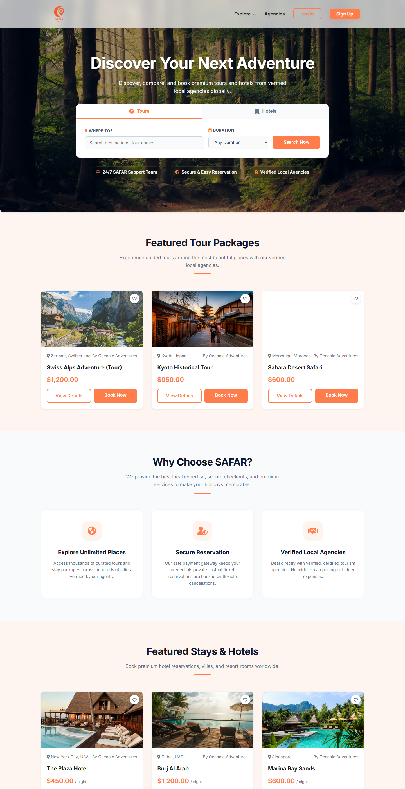
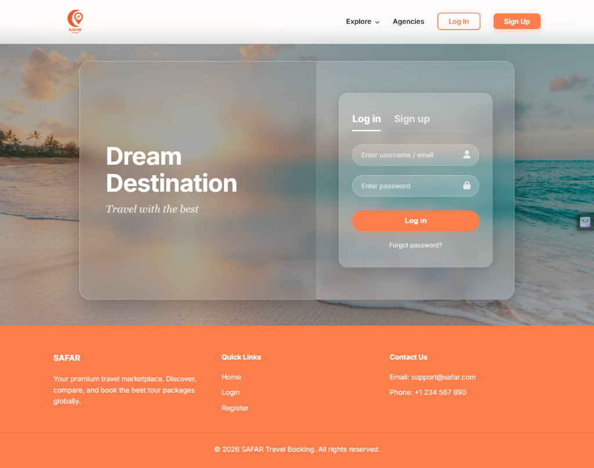
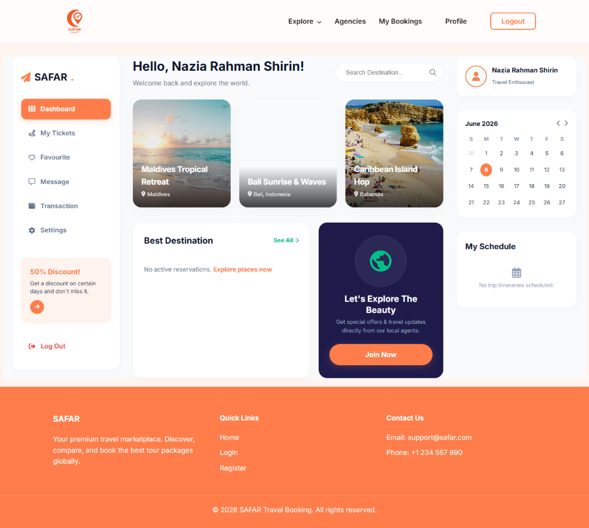
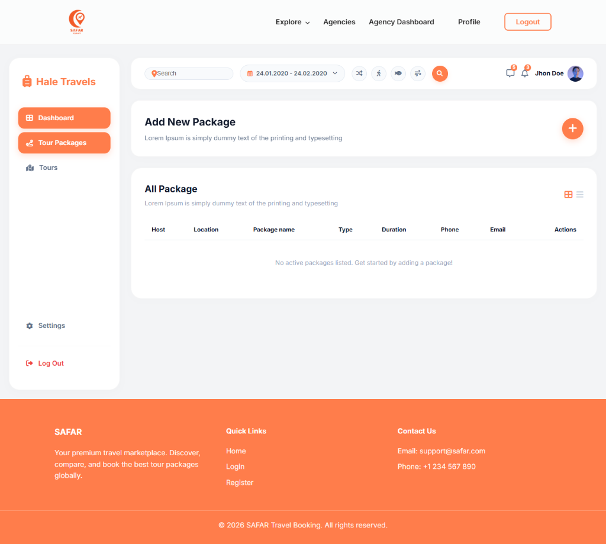
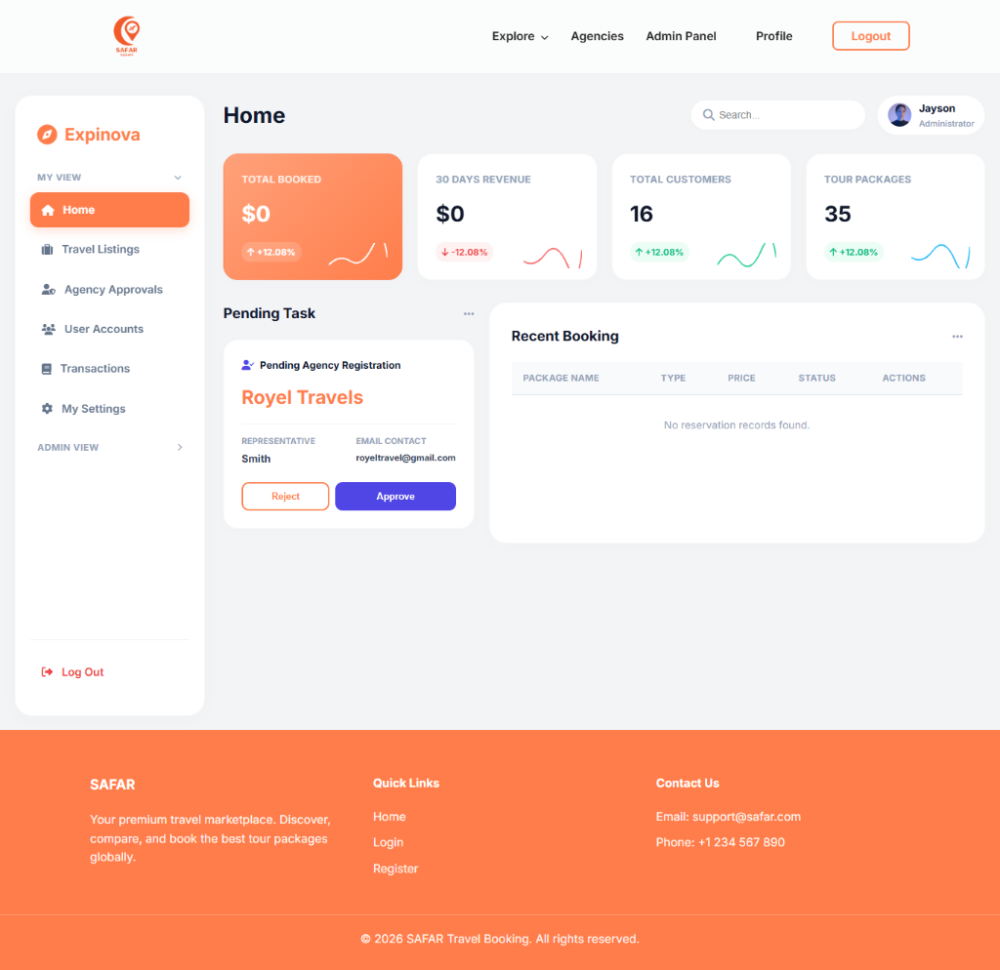

# ✈️ SAFAR - Premium Travel Booking & Marketplace

**SAFAR** is a state-of-the-art, dynamic travel booking and marketplace application designed to connect travel vendors (Agencies) directly with globetrotters (Travelers). The platform operates as a multi-tenant booking ecosystem with secure role-based access control, allowing travelers to discover stays/tours and book itineraries, while agencies can publish packages and manage customer reservations.

The application features a premium user interface incorporating modern glassmorphism styling, clean animations, and highly structured layouts tailored for visual excellence.

---

## 🎨 Main Features & Interface Highlights

### 1. Market Landing Page & Discovery Engine
The homepage acts as a travel marketplace directory featuring:
- A **Tabbed Search Widget** allowing users to query tours and stays separately.
- Grid listings of **Featured Tours** and **Featured Stays/Hotels**.
- Customer reviews, booking workflows, and "Why Choose Us" features cards.

<p align="center">
  
</p>

---

### 2. Glassmorphic User Authentication
Beautiful split-panel login and signup pages implementing glassmorphic layouts:
- Dynamic sliding input indicators.
- Instant client-side validation hints.

<p align="center">
  
</p>

---

### 3. Traveler Control Center (3-Column Dashboard)
A highly detailed personal traveler board styled after modern booking systems:
- **Left Column**: brand navigation sidebar with discount callouts.
- **Center Column**: greeting section, trending destination slider cards, and active reservations feed.
- **Right Column**: traveler profile avatar badge, customized calendar grids, and dynamic trip scheduling lists.

<p align="center">
  
</p>

---

### 4. Travel Agency Admin Dashboard
An orange-themed administration workspace for listing owners:
- **Header Widgets**: search fields, custom datepicker badge, quick icon shortcuts, and notification counters.
- **Add New Package Banner**: white card layout featuring a large floating Plus (`+`) action button.
- **All Package Table**: list detailing hosts, locations, package names, trip types, durations, phone, and email contacts.
- **Interactive Action Dropdown**: custom view/edit/delete floating dropdown menu.

<p align="center">
  
</p>

---

### 5. Expinova Main Administrator Panel
A comprehensive control panel for website administrators:
- **Top Row KPIs**: summary cards showing total bookings, revenue, customers, and active packages with custom SVG sparkline graphs.
- **Pending Tasks Column**: dynamic feed with quick "Approve" / "Reject" controls for pending agency registrations.
- **Recent Bookings Table**: customer transaction logs showing traveler details and reservation statuses.

<p align="center">
  
</p>

---

## 🛠️ Technology Stack & Architectures

### Core Web Server Setup (XAMPP / PHP)
- **Backend & Logic**: Vanilla PHP + PDO prepared statements for secure, SQL-injection-free query execution.
- **Database**: SQLite (file-based `safar_db.sqlite` database engine).
- **Styling**: Vanilla CSS3 Custom design guidelines.

### Modern Decoupled Service Setup (Alternative Service Layer)
- **Frontend Client**: React (Vite) with component-level styling on port `5173`.
- **API Gateway Proxy**: Node.js + Express API router on port `5000`.
- **Backend Engine**: Python + FastAPI service layers on port `8000`.
- **Primary Database**: PostgreSQL relational database on port `5432`.

---

## 📐 Software Design Patterns Implementation

To guarantee database transaction isolation and clean architecture boundary layers, 5 software design patterns are implemented inside the backend service (`/backend`):

1. **Singleton Pattern**: Ensures that only a single SQLAlchemy engine and session pool is created and reused globally across the lifecycle of the API instance.
2. **Factory Method Pattern**: Decouples database model mappings, formatting package listing properties according to their type (`tour` vs `hotel`) dynamically.
3. **Strategy Pattern**: Abstract pricing calculation algorithms, dynamically computing flat traveler rates for tour packages vs nightly/room calculations with extra fees for stay packages.
4. **Observer Pattern**: Triggers asynchronous notification simulations and logging handlers automatically whenever booking reservation statuses update.
5. **Facade Pattern**: Unifies complex steps (verifying databases, running strategies, registering users, committing transactions, emitting observations) under a single simplified functional execution call.

---

## 🚀 Installation & Local Environment Setup

### Prerequisites
- XAMPP / WampServer (with PHP 8.0+ and SQLite extensions enabled).
- Git installed on path.

### Steps to Run
1. Clone the repository into your local server root:
   ```bash
   git clone https://github.com/rs-nazia/Safar-Web-App.git C:\xampp\htdocs\Safar-Web-App
   ```
2. Make sure the database file `safar_db.sqlite` inside the root directory has write permissions enabled for the web server user.
3. Start the **Apache** module from your XAMPP Control Panel.
4. Open your browser and navigate to:
   ```url
   http://localhost/Safar-Web-App/pages/index.php
   ```

### Default Login Accounts (Password: `admin123`)
* **Administrator**: `admin@safar.com`
* **Verified Agency**: `rsscalers042@gmail.com`
* **Traveler User**: `nazia@gmail.com`
